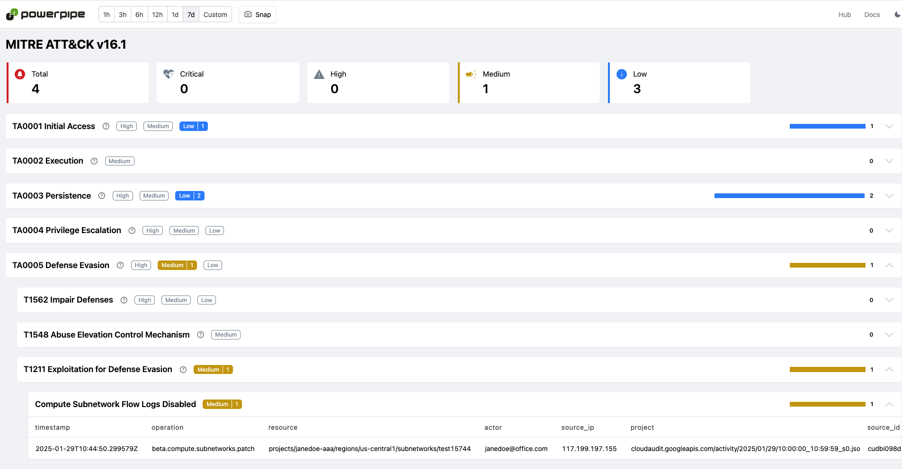
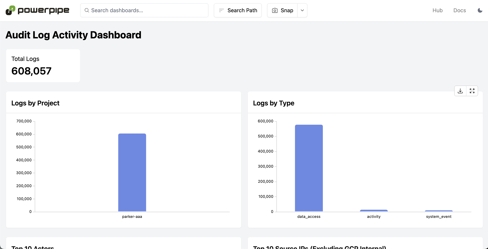

# GCP Audit Log Detections Mod for Powerpipe

[Tailpipe](https://tailpipe.io) is an open-source CLI tool that allows you to collect logs and query them with SQL.

[GCP](https://cloud.google.com) provides on-demand cloud computing platforms and APIs to authenticated customers on a metered pay-as-you-go basis.

The [GCP Audit Log Detections Mod](https://hub.powerpipe.io/mods/turbot/tailpipe-mod-gcp-audit-log-detections) contains pre-built dashboards and detections, which can be used to monitor and analyze activity across your GCP projects.

Run detection benchmarks:


View insights in dashboards:


## Documentation

- **[Dashboards →](https://hub.powerpipe.io/mods/turbot/tailpipe-mod-gcp-audit-log-detections/dashboards)**
- **[Benchmarks and detections →](https://hub.powerpipe.io/mods/turbot/tailpipe-mod-gcp-audit-log-detections/benchmarks)**

## Getting Started

Install Powerpipe from the [downloads](https://powerpipe.io/downloads) page:

```sh
# MacOS
brew install turbot/tap/powerpipe
```

```sh
# Linux or Windows (WSL)
sudo /bin/sh -c "$(curl -fsSL https://powerpipe.io/install/powerpipe.sh)"
```

This mod also requires GCP audit logs to be collected using [Tailpipe](https://tailpipe.io) with the [GCP plugin](https://hub.tailpipe.io/plugins/turbot/gcp):
- [Get started with the GCP plugin for Tailpipe →](https://hub.tailpipe.io/plugins/turbot/gcp#getting-started)

Install the mod:

```sh
mkdir dashboards
cd dashboards
powerpipe mod install github.com/turbot/tailpipe-mod-gcp-audit-log-detections
```

### Browsing Dashboards

Start the dashboard server:

```sh
powerpipe server
```

Browse and view your dashboards at **http://localhost:9033**.

### Running Benchmarks in Your Terminal

Instead of running benchmarks in a dashboard, you can also run them within your
terminal with the `powerpipe benchmark` command:

List available benchmarks:

```sh
powerpipe benchmark list
```

Run a benchmark:

```sh
powerpipe benchmark run gcp_audit_log_detections.benchmark.mitre_attack_v161
```

Different output formats are also available, for more information please see
[Output Formats](https://powerpipe.io/docs/reference/cli/benchmark#output-formats).

## Open Source & Contributing

This repository is published under the [Apache 2.0 license](https://www.apache.org/licenses/LICENSE-2.0). Please see our [code of conduct](https://github.com/turbot/.github/blob/main/CODE_OF_CONDUCT.md). We look forward to collaborating with you!

[Tailpipe](https://tailpipe.io) and [Powerpipe](https://powerpipe.io) are products produced from this open source software, exclusively by [Turbot HQ, Inc](https://turbot.com). They are distributed under our commercial terms. Others are allowed to make their own distribution of the software, but cannot use any of the Turbot trademarks, cloud services, etc. You can learn more in our [Open Source FAQ](https://turbot.com/open-source).

## Get Involved

**[Join #tailpipe and #powerpipe on Slack →](https://turbot.com/community/join)**

Want to help but don't know where to start? Pick up one of the `help wanted` issues:

- [Powerpipe](https://github.com/turbot/powerpipe/labels/help%20wanted)
- [Tailpipe](https://github.com/turbot/tailpipe/labels/help%20wanted)
- [GCP Audit Log Detections Mod](https://github.com/turbot/tailpipe-mod-gcp-audit-log-detections/labels/help%20wanted)
